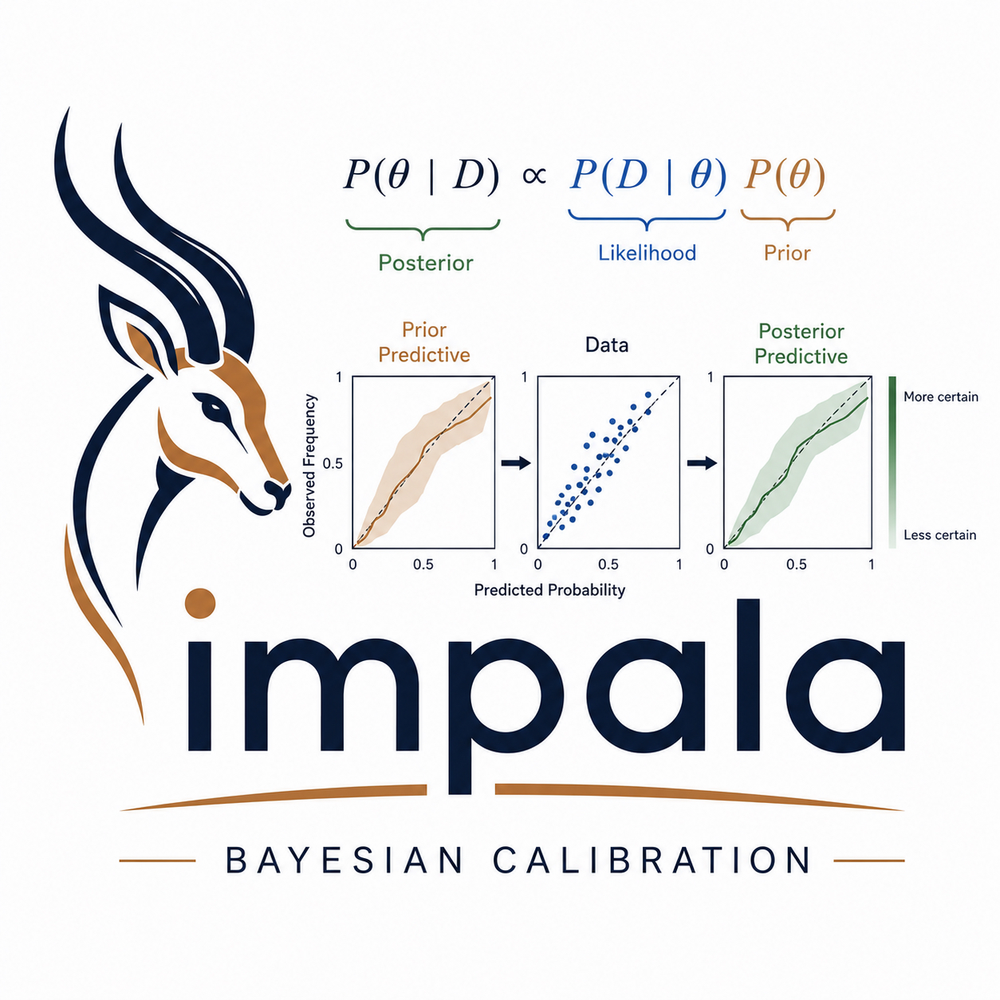

Impala R package
================



*R library for modular Bayesian model calibration.  Posterior exploration includes tempering and adaptive MCMC.*

<!-- badges: start -->
[](https://github.com/sandialabs/rimpala/actions/workflows/r.yml)
[](https://CRAN.R-project.org/package=impala)
<!-- badges: end -->

Python tools for modular Bayesian model calibration. Posterior exploration includes tempering and adaptive MCMC. This is an R translation of LANLs [Impala](https://github.com/lanl/impala). 

### Installation
------------------------------------------------------------------------------
v0.1.2 is on [CRAN](https://cran.r-project.org/package=impala) and can
be installed as

``` r
install.packages("impala")`
```

For a more up to date, but may not be stable version from git
repository.

1.  Download zip or tar.gz of package or clone repository
2.  Install into R (\> 4.3.0)

``` r
library(devtools)
install_github("sandialabs/rImpala")
```

------------------------------------------------------------------------------
